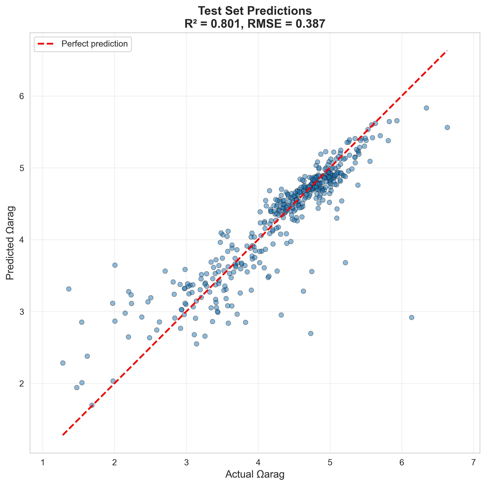
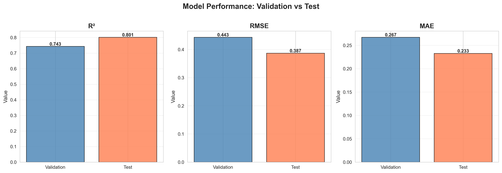
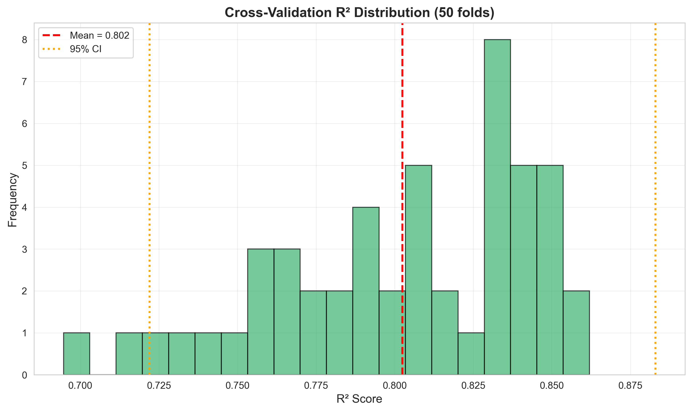
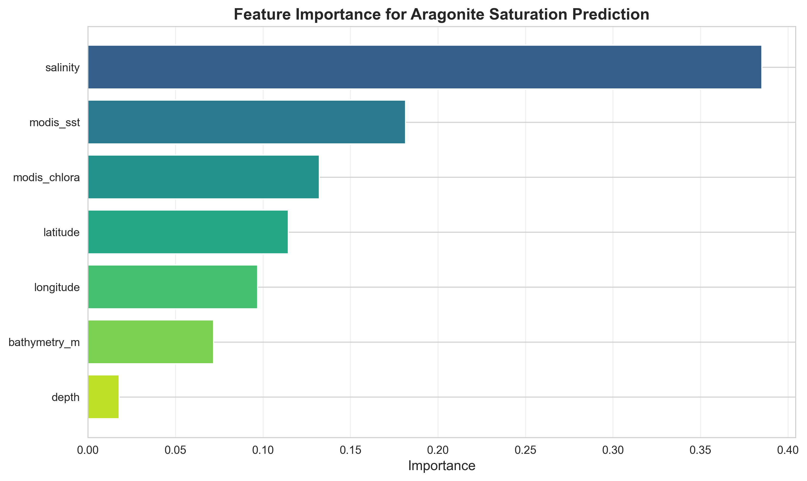
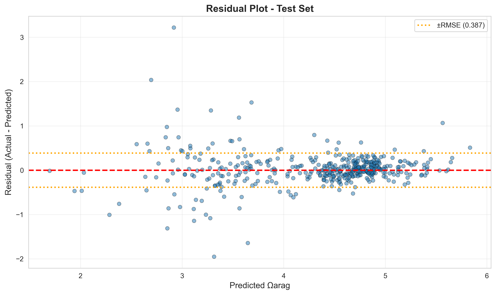
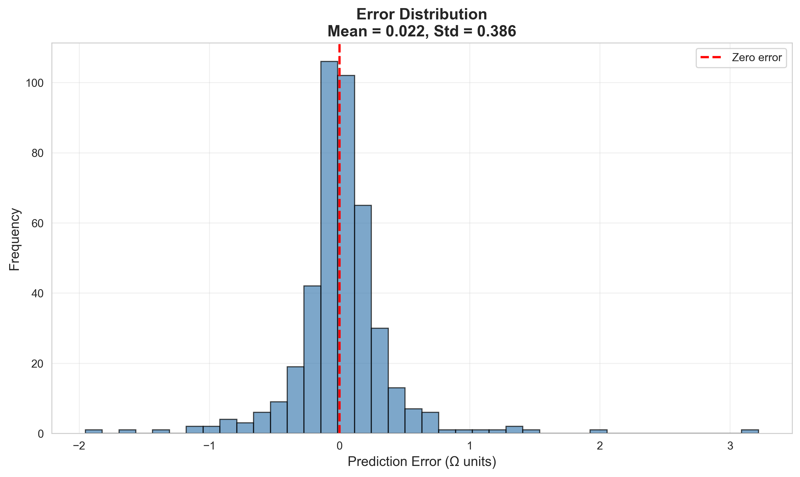
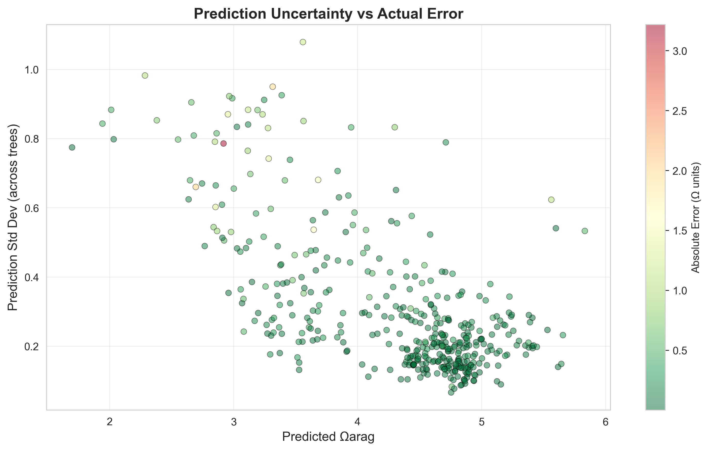
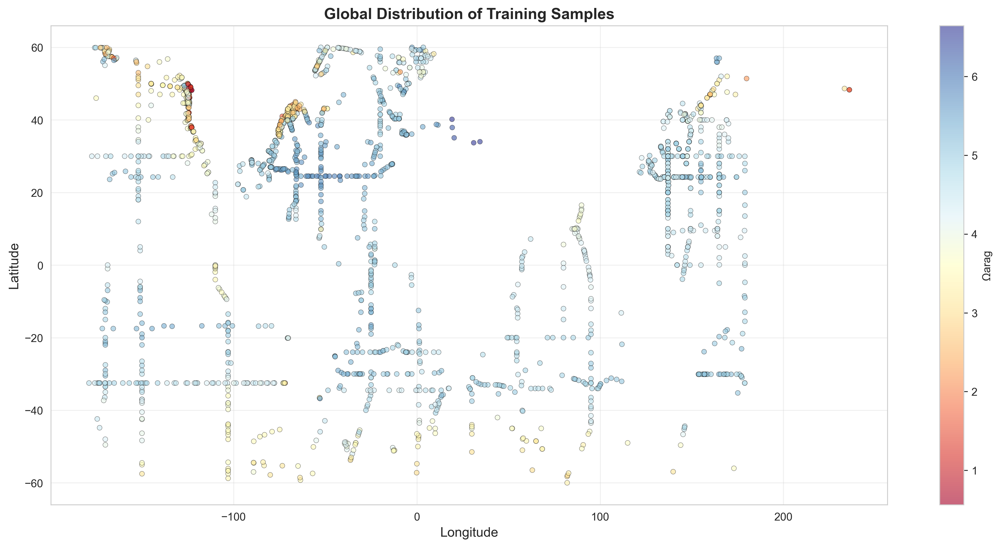

# Virtual Aragonite Sensor: ML-Based Ocean Acidification Monitoring

Machine learning pipeline for predicting coral reef health from satellite data.

## Problem

Ocean acidification threatens coral reefs by reducing aragonite saturation (Ωarag), but measuring it requires expensive research cruises ($10,000+/day). This creates a critical bottleneck for coral restoration projects that need to identify suitable planting sites.

## Solution

An ML pipeline that predicts Ωarag from freely available satellite data (sea surface temperature, chlorophyll-a), enabling global ocean chemistry screening at zero marginal cost.

## Results
 
- **R² = 0.80** on held-out test data
- **RMSE = 0.39 Ω units** (9% relative error)
- **MAE = 0.23 Ω units** (mean absolute error)
- **Cross-validation**: 0.80 ± 0.04 R² (50-fold repeated CV)

## Methodology

### Data Sources
- **Chemistry**: GLODAP v2.2023 (ocean carbon measurements)
  - 2,140 samples after quality control
  - Temporal coverage: 2000-2021 (21 years)
  - Spatial coverage: 60°S to 60°N
- **Satellite**: MODIS-Aqua (NASA, 4km resolution)
  - Sea Surface Temperature (SST)
  - Chlorophyll-a concentration
- **Bathymetry**: ETOPO1 (seafloor depth)

### Model Architecture

Random Forest ensemble model implemented in scikit-learn with the following configuration:

- **Algorithm**: Random Forest Regressor (ensemble of 100 decision trees)
- **Tree depth**: Maximum depth of 15 levels
- **Split criteria**: Minimum 5 samples to split a node, minimum 2 samples per leaf
- **Feature sampling**: Square root of total features per split (√7 ≈ 2-3 features)
- **Training**: 60/20/20 train/validation/test split with 10-fold cross-validation (5 repeats)
- **Evaluation**: R², RMSE, and MAE metrics
- **Confidence scoring**: Ensemble variance across trees provides prediction uncertainty

The Random Forest approach was chosen over neural networks for its:
- Robustness to overfitting on small datasets (2,140 samples)
- Built-in feature importance ranking
- No hyperparameter tuning required for strong baseline performance
- Interpretable predictions via ensemble variance (confidence scores)

Model includes a `predict_with_confidence()` function that returns both predictions and uncertainty estimates based on inter-tree variance, enabling users to identify low-confidence predictions that may warrant in-situ validation.

### Input Features
1. Sea Surface Temperature (MODIS SST)
2. Chlorophyll-a concentration (MODIS)
3. Salinity (in-situ)
4. Bathymetry (seafloor depth)
5. Latitude
6. Longitude
7. Sample depth

## Project Structure
```
acid-project/
├── data/                 # Created by training pipeline*
│   ├── raw/              # Downloaded datasets
│   └── processed/        # Cleaned, merged data
├── scripts/
│   ├── 01_download_glodap.py           # Get ocean chemistry data
│   ├── 02_download_bathymetry.py       # Get bathymetry data
│   ├── 03_extract_satellite_gee.py     # Extract satellite features
│   └── 04_train_model.py               # Train model
├── models/
│   └── aragonite_model.pkl       # Trained model
├── visualizations/
│   ├── cv_distribution.png
│   ├── error_distribution.png
│   ├── feature_importance.png
│   ├── metrics_comparison.png
│   ├── prediction_uncertainty.png
│   ├── residuals.png
│   └── sample_distribution.png
├── .gitignore
├── README.md
└── requirements.txt
```

**Note: data/ directory is not included in the repository. It will be automatically created when running the training pipeline.*

## Usage

### Prerequisites
```bash
pip install -r requirements.txt
earthengine authenticate  # For satellite data
```

### Training Pipeline
```bash
# 1. Download ocean chemistry data
python scripts/01_download_glodap.py

# 2. Download bathymetry data
python scripts/02_download_bathymetry.py

# 3. Extract satellite data
python scripts/03_extract_satellite_gee.py

# 4. Train model
python scripts/04_train_model.py
```

### Making Predictions
```python
import pickle
import numpy as np

with open('aragonite_model.pkl', 'rb') as f:
    package = pickle.load(f)

model = package['model']
predict_fn = package['predict_with_confidence']

new_data = np.array([[35.0, 26.5, 0.15, 20.5, -155.2, 2500, 5.0]])
predictions, confidence = predict_fn(model, new_data)

print(f"Prediction: {predictions[0]:.2f} Omega")
print(f"Confidence: {confidence[0]:.1f}%")
```

## Performance Analysis

<table style="border-collapse: collapse; border: none; width: 100%;">
<tr style="border: none;">
<td width="45%" style="border: none; vertical-align: top; padding-right: 20px;">

### Model Metrics

- **Validation R²**: 0.743
- **Test R²**: 0.801
- **Validation RMSE**: 0.443 Ω units
- **Test RMSE**: 0.387 Ω units
- **Test MAE**: 0.233 Ω units
- **Relative error**: 9.0% of mean Ωarag value

</td>
<td width="55%" style="border: none; vertical-align: top;">

<p align="center">
  
</p>

</td>
</tr>
</table>

<p align="center">
  
</p>


### Cross-Validation Results
10-fold cross-validation with 5 repeats (50 total folds) demonstrates robust generalization:
- **Mean R²**: 0.8025
- **Standard deviation**: 0.0411
- **Range**: 0.6947 - 0.8620
- **95% CI**: [0.7220, 0.8830]

<p align="center">
  
</p>

The low standard deviation (0.04) indicates consistent performance across different data subsets, confirming model stability.

### Feature Importance
Analysis via Random Forest feature importance reveals:

<p align="center">
  
</p>

1. **Salinity** (38.5% importance) - Primary control on carbonate ion concentration
2. **SST** (18.2%) - Temperature affects CO₂ solubility and carbonate equilibria
3. **Chlorophyll-a** (13.2%) - Indicates biological CO₂ uptake patterns
4. **Latitude** (11.4%) - Captures latitudinal temperature/chemistry gradients
5. **Longitude** (9.7%) - Regional oceanographic patterns
6. **Bathymetry** (7.2%) - Proxies for upwelling and mixing dynamics
7. **Depth** (1.8%) - Minor influence within surface sampling range

The dominance of salinity aligns with marine chemistry theory, as it directly controls the concentration of carbonate ions available for aragonite formation.

### Error Analysis

<p align="center">
  
</p>

Residual plot shows random scatter around zero with no systematic bias, confirming model assumptions.

<p align="center">
  
</p>

Error distribution is approximately normal with mean near zero, validating statistical assumptions.

### Practical Accuracy
- **Can reliably distinguish** excellent sites (Ω > 3.5) from poor sites (Ω < 2.5)
- **RMSE of 0.39** is within 2× typical measurement uncertainty (~0.15-0.20)
- **Sufficient precision** for screening/prioritization (primary use case)
- **Confidence scoring** enables identification of uncertain predictions for follow-up validation
- **9% relative error** demonstrates strong predictive power across the operational range

<details>
<summary><b>Additional Visualizations</b></summary>

#### Prediction Uncertainty Analysis
<p align="center">
  
</p>

#### Global Sample Distribution
<p align="center">
  
</p>

</details>

## Scientific Context

### Ocean Acidification & Coral Reefs

When atmospheric CO₂ dissolves in seawater, it forms carbonic acid (H₂CO₃), which dissociates and reduces the availability of carbonate ions (CO₃²⁻):
```
CO₂ + H₂O ⇌ H₂CO₃ ⇌ H⁺ + HCO₃⁻ ⇌ 2H⁺ + CO₃²⁻
```

This matters because corals build their skeletons from aragonite (a form of calcium carbonate, CaCO₃), which requires carbonate ions:
```
Ca²⁺ + CO₃²⁻ → CaCO₃ (aragonite)
```

### Aragonite Saturation State (Ωarag)

The aragonite saturation state quantifies whether seawater chemistry favors aragonite formation or dissolution:
```
Ωarag = [Ca²⁺][CO₃²⁻] / Ksp
```

Where:
- **[Ca²⁺]** and **[CO₃²⁻]** are the actual concentrations of calcium and carbonate ions in seawater
- **Ksp** is the solubility product constant - the theoretical ion concentration product at which aragonite would be in equilibrium (neither forming nor dissolving)

**Interpreting Ω:**
- **Ω > 1**: Seawater is *supersaturated* - aragonite formation is thermodynamically favorable
- **Ω = 1**: Seawater is *saturated* - equilibrium (no net formation or dissolution)
- **Ω < 1**: Seawater is *undersaturated* - existing aragonite will dissolve

The solubility product Ksp increases with depth (pressure) and decreases with temperature, which is why cold, deep waters are naturally more corrosive to carbonates.

**Biological Thresholds:**
- **Ω > 3.5**: Excellent coral growth and calcification
- **Ω = 3.0-3.5**: Good conditions, healthy reefs
- **Ω = 2.5-3.0**: Marginal conditions, reduced growth
- **Ω < 2.5**: Stressed corals, increased mortality risk
- **Ω < 1.0**: Undersaturated - net dissolution of existing structures
```

### Why This Matters
- 50% of coral reefs could be lost by 2050 (IPCC)
- Restoration projects need $100k-$1M+ per site
- Site assessment is a major bottleneck
- This tool enables free global screening

## References

1. Feely et al. (2004) - Ocean acidification impact on CaCO₃
2. GLODAP v2.2023 - Global ocean carbon database
3. MODIS-Aqua - NASA ocean color mission
4. Mucci (1983) - Aragonite solubility in seawater

## Acknowledgments

- NOAA NCEI for GLODAP database
- NASA for MODIS satellite data
- Google Earth Engine for data processing infrastructure
- Anthropic Claude for technical guidance

## License

MIT License - Free to use for research and conservation

## Author

Trenton Hatch - Northeastern University
Computer Science (AI concentration) | allan.tr@northeastern.edu
